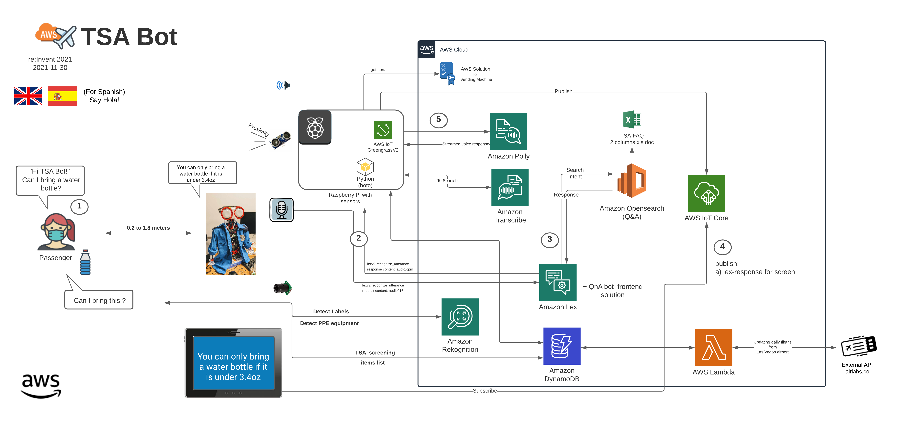

# TSA Bot
This repo contains sample code for TSA bot presented at AWS conference - Reinvent 2021- AWS Builder's Fair. The project sample code is intended to help you replicate what you may have seen in a Builder's Fair project demo at an event, and to set up AWS infrastructure for further experimentation.

## Overview 
T. S. A. Bot is a humanoid robot, that can **assist** with the security screening process at the airport. The bot is powered by AWS to showcase how you can use AWS services to solve everyday challenges. 

Below is the demo from reinvent 2021 on how TSA bot can help with airport screening process:

https://user-images.githubusercontent.com/19521063/149061793-9b15dce8-66a6-467c-b3db-26b4bbcc3083.mov

### Workflow
The TSA bot continously provides instructions on the correct screening procedure (what items can you carry vs need to put in a bin). Passenger can ask questions like "Do I need to remove my jacket?" or  "Do I need to remove my belt?" "When is the next flight to Boston?" and bot responds with an answer. Passenger can also ask if they can carry a specific object and bot scans the object and respond.

For question and answers, the bot uses Amazon Lex service. For getting flight info, bot fetches the results from DynamoDB that is storing daily flight from an external API. For detecting object, the bot uses Amazon Rekognition.

Exhaustive list of questions available on the git repository in the List of QnA/Questions-EN-ES.md file.

## Architecture

## Repository structure

| Folder | Purpose | 
| --- | ---
| /docs/   | Project Documentation and BOM (hardware components)|
| /images/   | Project Images |
| /QnA/   | List of questions and answers to import |
| /cloudformation-templates/ | Deployment templates for TSA Bot components|
| /tsa-full/ | TSA Bot scripts and configurations to be deployed on the Raspberry Pi |

# Install the TSA Bot solution
## Getting started (step by step)

Follow the step by step deployment instructions in this [getting started documentation](Docs/GettingStarted.md). This describes how to deploy the resources locally on the bot, and resources in the cloud.
  
More details about servo motors and configuration [here](Docs/TSA-Bot-ServoMotors-details.md)

## Security
See [CONTRIBUTING](CONTRIBUTING.md) for more information.

## License

This library is licensed under the MIT-0 License. See the [LICENSE](LICENSE) file.
